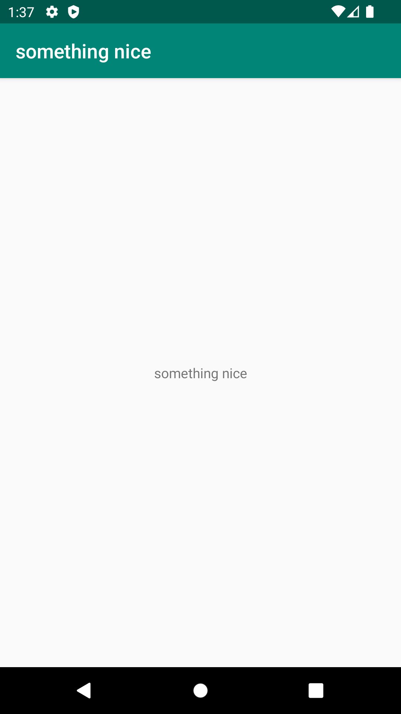

# Rapport

**

"app_name" ändrades till "something nice". Screenshot på virtuell enhet lades till.
Kodsnutt:
```
<resources>
        <string name="app_name">something nice</string>
</resources>**
```


           



